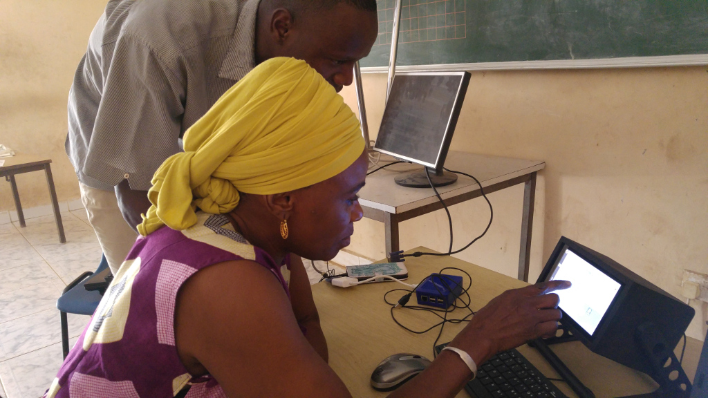

# Press Kit

Document status: *DRAFT - INCOMPLETE*

The press kit repository contains information clippings (articles) and media files (photos) for publication or to just be informed about our events, plans and achievements.

## Contents

### Events

- 2017-04-12 [Demonstration of the Raspberry Pi computer at the Sanyang Lower Basic School Computer Lab](20170412-sanyang-computer-lab-raspberrypi-demonstration)

## About the project

We would like to provide IT and communication lessons for pupils of Sanyang Lower Basic School,
to give them access to knowledge and tools to create career opportunities in The Gambia.
The Raspberry Pi computer can help us to reach this goal. It also creates opportunities to
connect with other schools worldwide.

With this computer setup we would like to support the school (curricular, administrative,
infrastructural), and introduce students - the children - to computing as well as prepare
for international communication, to inspire and help them work out ideas they might
have for their careers.

We aim to scale-up to more schools as soon as we see the concept is working and sustainable.

*A Sanyang Lower Basic School teacher is being introduced to programming with Scratch on a Raspberry Pi computer in a 3D printed case with touch-screen* - photo by Rob van den Bogaard-Braaf

## Current next steps

- Build documentation and press kit *(Netherlands)*
- Discuss details on initial courses with the school *(Gambia)*
- Start initial courses to build knowledge momentum *(Gambia)*
- Investigate funding options for the pilot/showcase lab; how should we collect donations? *(Netherlands)*
- Find the best internet provider and plan for the Sanyang area (current connectivity of the Computer Lab is quite unreliable) *(Gambia)*
- Find prospective partner schools for exchange and collaboration *(Netherlands)*
- Investigate cost-reduction opportunities (e.g. recycle screens/tv sets available, investigate minimal UPS setup, some cables are cheaper in EU, some in The Gambia) *(Gambia and Netherlands)*
